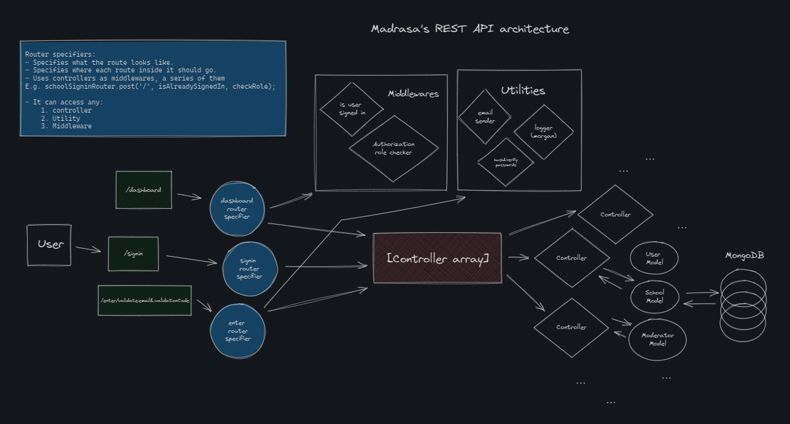

# Bus-Tracker-Server
This is the backend for my [Madrasa Management System](https://github.com/SHADOWZXCV/Wezzaa).
## Functionality & Purpose
Madrasa Management system is School administration system for managing bus moderators & the children they're responsible for.
#### Features:
- School account setup after verification.
- A System that verifies school emails based on the verification code we sent to them by the [special server](https://github.com/SHADOWZXCV/Madrasa-Special-Server).
- School administration system.

    - `CRUD` for moderators

    - `CRUD` for children info & images
#### TODO:
- [ ] Manage routes & change moderators for each route in case of emergency situations.

- [ ] Add special event system for tracking moderators in-time and out-time.

- [ ] Also make it for children in-bus-time and out-bus-time.
## Architecture
### Folder structure:
<pre>
|- route
    |-- index.js
    |-- {specific_route_folder}/index.js
|- controller 
    |-- authentication
    |-- protected
|- middleware
|- config
|- model
    |-- schema.js
    |-- {models}.js
|- index.js 
</pre>

### Connections & interactions:

The server runs like so:
<pre>index.js -> route/index.js -> route/{right_folder}/index.js -> controller ( or middleware folder ) -> <- {model}</pre>


## How to use
1. Install the server:
    ```bash
    npm install
    ```
2. Setup your .env file in root directory:
    ```bash
    NODE_ENV = 'development or production'
    DBUri = 'DBUri'
    SS = 'session_secret(use-a-128-bit-good-secret)'
    dbName = 'dbName'
    origin = 'the_front_end_uri_of_the_system'
    googleEmailPass = 'google_email_pass_for_sending_emails'
    # 3 hrs session time for school in ms
    sessionTTLSchool = 10800000 #put school account session timeout in here in `ms`
    ```
3. Run the server:
    ```bash
    npm run dev
    ```